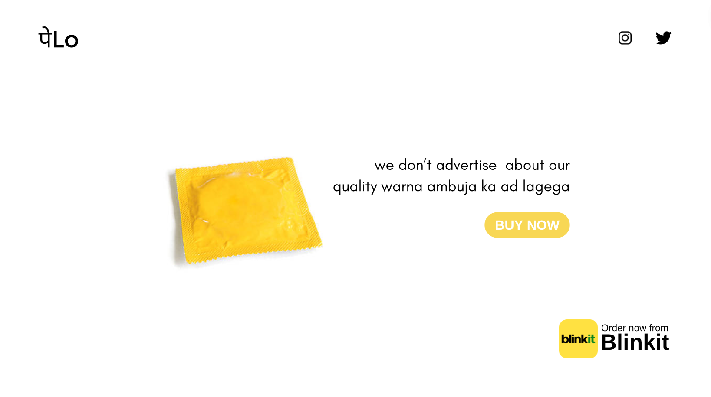

# पेLo - HTML Code Readme

This is the HTML code for a webpage template named पेLo. The template features a responsive design, social media icons, and a call-to-action button. The template is designed to be visually appealing and easy to customize for your specific use case.

## Features

- Responsive design for various screen sizes.
- Social media icons with clickable links.
- Call-to-action button.
- Eye-catching footer with branding.

## Preview

## Usage

1. Simply copy the HTML code from `index.html`.
2. Customize the content, images, and links as needed for your project.
3. You can modify the CSS styling in the `<style>` section to match your branding.

## Contributing

Contributions are welcome! If you find any issues or have suggestions for improvements, feel free to open an issue or create a pull request.

## License

This project is licensed under the [MIT License](LICENSE).

---

Designed and coded by [Your Name].

For more templates and projects, visit [Your Website/Portfolio](https://yourwebsite.com).
